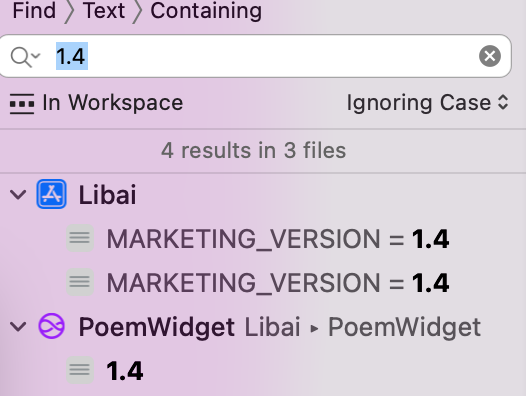

# How release new version
## Create new branch
releases/xxx
## Update version in Xcode config
Just search previous version

## Update materials in appstore folder
1. Create a new folder named with new version
2. Copy old version content
3. Update
### 更新 what's new
根据commit history
### 更新 description
如果有新增feature的话
### 更新 preview
新截图
## 更新 appstoreconnect 
1. 更新截图
2. 更新 What's New in This Version
3. 更新 build
4. check support url
应该是 HDiary 的 support URL，例如 `websites/hdiary/index.html` 对应的线上地址。
这个网站应该可以访问
5. Don't Add for review

## 提交 test flight
1. 添加 external group
2. Add what to test
3. TF 状态应该是 waiting for review

## 测试 test flight
1. 应该会收到一个邮件，邀请加入test flight
2. AppStore connect里 TF 状态应该是Testing

## 提交 review

点击 "Add for review" 按钮
状态变成 waiting for review
也会收到邮件