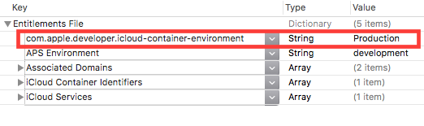

Add the following entry to your entitlements file and perform a clean build.

This allows you to run your application in Xcode with the CloudKit in the production mode.

Entry to add: `com.apple.developer.icloud-container-environment` with value: `Production`. Note: Will not work with simulator

## Link
- [Share](https://stackoverflow.com/questions/30182521/use-production-cloudkit-during-development/40414108#40414108)